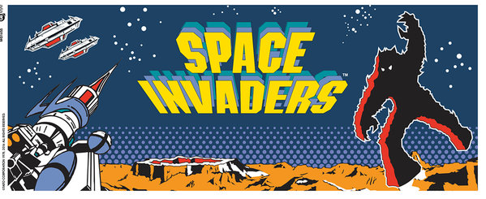
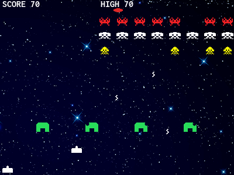
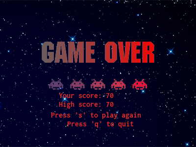

# Space Invaders

A small cross-platform desktop Space Invaders game written in Go. Every frame is drawn in Go and shown in a native webview window, which calls straight into Go through [webview_go](https://github.com/webview/webview_go)'s `Bind`. There's no game engine, GUI toolkit or web server.



The story behind the app is in the original article, [Create a simple cross-platform desktop game with Go](https://medium.com/sausheong/create-a-simple-cross-platform-desktop-game-with-go-8e5432128c9b). The game has changed a lot since then.



## How to play

| Key | Action |
|---|---|
| `s` | Start, or play again after game over |
| `←` / `→` | Move the cannon (hold to keep moving) |
| `Space` | Fire |
| `p` | Pause / resume |
| `q` | During play, back to the title screen; on the title or game over screen, quit |
| `j` | Switch the Jev autopilot on or off (only in builds with `-tags jev`, see below) |

- **Scoring:** aliens are worth 30, 20 and 10 points from the top row down. The mystery UFO that crosses the top is worth 50 to 300.
- **Lives:** you have 3 lives. The game ends when you lose the last one, or when the aliens reach your row.
- **Speed:** the aliens speed up as their numbers drop. Clear a wave and the next starts lower and faster.
- **Shields:** four shields absorb bombs and shots, and wear away as they're hit.
- **Bombs:** only the lowest alien in each column can drop one.
- **High score:** saved between sessions.

## Build and run

Requirements:

- Go 1.26 or later. The module pins `toolchain go1.26.8`, which Go downloads if needed.
- cgo and a C/C++ compiler, because webview wraps the operating system's own web view:
  - **macOS:** Xcode Command Line Tools (`xcode-select --install`).
  - **Linux:** GTK 3 and WebKitGTK development packages, e.g. `sudo apt install libgtk-3-dev libwebkit2gtk-4.0-dev`.
  - **Windows:** the [WebView2](https://developer.microsoft.com/microsoft-edge/webview2/) runtime (preinstalled on Windows 10/11) and a compiler such as MinGW-w64.

All assets are embedded in the binary, so it runs straight from a checkout:

```sh
go run ./cmd/invaders
```

Or install it:

```sh
go install github.com/sausheong/invadersapp/cmd/invaders@latest
```

To build a standalone binary:

```sh
go build -o invaders ./cmd/invaders                               # macOS / Linux
go build -ldflags="-H windowsgui" -o invaders.exe ./cmd/invaders  # Windows, without a console window
```

To build the macOS app bundle:

```sh
scripts/build-macOS
open invaders.app
```

`scripts/build-macOS` passes any arguments to `go build`, e.g. `scripts/build-macOS -tags jev`. The app binary isn't kept in git; build it, or download it from a release.

Each [release](https://github.com/sausheong/invadersapp/releases) includes a prebuilt Apple Silicon app. It's unsigned, so right-click it and choose **Open** the first time.

## Jev autopilot (optional)

[Jev](https://docs.typesafe.ai/introduction), TypeSafe's System One model, can play the game. The autopilot is compiled in only with the `jev` build tag; a normal build contains none of it.

```sh
go build -tags jev -o invaders ./cmd/invaders
TYPESAFE_API_KEY=... ./invaders -jev    # or press j during play
```

- **API key:** read from `TYPESAFE_API_KEY`, then a `.env` file in the current directory, then a `typesafe-api-key` file next to the high score file.
- **Unattended play:** with the autopilot on, it starts a new game by itself.

How it works:

- **Code predicts:** it simulates the falling bombs and the moving formation, allowing for Jev's response time.
- **Code describes:** it describes about 20 spots the cannon could move to, in plain language: whether it's safe to get there, and whether an alien will be in the line of fire on arrival.
- **Jev decides:** it picks a spot (a Choice question), whether to fire (a Noul question), and an escape direction (another Choice).
- **Code acts:** it steers the cannon to the chosen spot. It drops a fire decision if the line of fire changed after Jev saw it.
- **Jev plans an escape:** each request also asks which way to run if a new bomb appears right overhead. If the cannon's course runs into a bomb before a fresh answer could arrive, code carries out that escape at once instead of waiting for the network.

Every decision is scored:

- **Moves** by whether the cannon survives the next second.
- **Shots** by what they hit.

The running score is shown in the bottom-right corner. Every decision is logged to `jev-actions.jsonl`, and `jev-summary.txt` keeps a summary up to date. Both are next to the high score file.

## How it works

- **Game loop** (`internal/game`): a single goroutine owns the game state. Fifty times a second it reads input, steps the simulation, draws the frame with [gift](https://github.com/disintegration/gift), and publishes it as a PNG data URI with a sequence number.
- **Window** (`cmd/invaders`): hosts a small embedded page (`game.html`) and binds three Go functions into it:
  - `frame(lastSeq)` returns a new frame only when one is available.
  - `keyDown(code)` and `keyUp(code)` pass keyboard input straight to Go.
- **Assets** (`internal/assets`): the sprites, backgrounds, sounds and page are embedded with `//go:embed`. Sounds play through [beep](https://github.com/gopxl/beep) and are decoded once at startup.
- **Autopilot** (`internal/autopilot`): the game knows nothing about Jev. It defines a small `Autopilot` interface and gives an autopilot a read-only snapshot (`game.View`) each tick. `cmd/invaders/jev.go`, compiled only with `-tags jev`, plugs the Jev autopilot in.

```
cmd/invaders/          the app: window, Bind wiring, flags
  main.go
  jev.go               -tags jev: plugs in the autopilot
internal/game/         rules, state, drawing, input, high score
internal/assets/       embedded page, images and sounds; sound playback
internal/autopilot/    Jev autopilot: forecasting, decisions, scoring
internal/typesafe/     minimal TypeSafe System One API client
docs/                  images and articles
scripts/build-macOS    builds invaders.app
invaders.app/          macOS app bundle (the binary is built, not committed)
```

## Tests

```sh
go test ./...                                              # everything, no network
go test -tags live -run TestJev -v ./internal/autopilot    # autopilot against the live TypeSafe API
INVADERS_SNAPSHOT_DIR=/tmp/snap go test -run TestRenderSnapshots ./internal/game   # render screenshots
```

## Screenshots

 

## Credits

- Sound effects from [Classics United](http://www.classicgaming.cc/classics/space-invaders/sounds).
- Thanks to Ibrahim Wu, who helped debug the original app on Windows.
- Thanks to Serge Zaitsev for the original [webview](https://github.com/zserge/webview) package, and to the maintainers of [webview_go](https://github.com/webview/webview_go) and [gopxl/beep](https://github.com/gopxl/beep).
