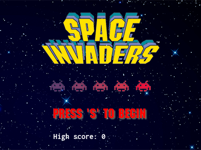

# Space Invaders

A small cross-platform desktop Space Invaders game written in Go. Every frame is drawn in Go and shown in a native webview window, which calls straight into Go through [webview_go](https://github.com/webview/webview_go)'s `Bind`. There's no game engine, GUI toolkit or web server.


The story behind the app is in the original article, [Create a simple cross-platform desktop game with Go](https://medium.com/sausheong/create-a-simple-cross-platform-desktop-game-with-go-8e5432128c9b). The game has changed a lot since then.


## How to play

| Key | Action |
|---|---|
| `s` | Start, or play again after game over |
| `←` / `→` | Move the cannon (hold to keep moving) |
| `Space` | Fire |
| `p` | Pause / resume |
| `q` | During play, back to the title screen; on the title or game over screen, quit |
| `j` | Switch the Jev autopilot on or off (only in builds with `-tags jev`, see below) |

- **Scoring:** aliens are worth 30, 20 and 10 points from the top row down. The mystery UFO that crosses the top is worth 50 to 300.
- **Lives:** you have 3 lives. The game ends when you lose the last one, or when the aliens reach your row.
- **Speed:** the aliens speed up as their numbers drop. Clear a wave and the next starts lower and faster.
- **Shields:** four shields absorb bombs and shots, and wear away as they're hit.
- **Bombs:** only the lowest alien in each column can drop one.
- **High score:** saved between sessions.

## Build and run

Requirements:

- Go 1.26 or later. The module pins `toolchain go1.26.8`, which Go downloads if needed.
- cgo and a C/C++ compiler, because webview wraps the operating system's own web view:
  - **macOS:** Xcode Command Line Tools (`xcode-select --install`).
  - **Linux:** GTK 3 and WebKitGTK development packages, e.g. `sudo apt install libgtk-3-dev libwebkit2gtk-4.0-dev`.
  - **Windows:** the [WebView2](https://developer.microsoft.com/microsoft-edge/webview2/) runtime (preinstalled on Windows 10/11) and a compiler such as MinGW-w64.

All assets are embedded in the binary, so it runs straight from a checkout:

```sh
go run .
```

To build a standalone binary:

```sh
go build -o invaders                               # macOS / Linux
go build -ldflags="-H windowsgui" -o invaders.exe  # Windows, without a console window
```

To build the macOS app bundle:

```sh
./build-macOS
open invaders.app
```

`build-macOS` passes any arguments to `go build`, e.g. `./build-macOS -tags jev`.

Each [release](https://github.com/sausheong/invadersapp/releases) includes a prebuilt Apple Silicon app. It's unsigned, so right-click it and choose **Open** the first time.

## Jev autopilot (optional)

[Jev](https://docs.typesafe.ai/introduction), TypeSafe's System One model, can play the game. The autopilot is compiled in only with the `jev` build tag; a normal build contains none of it.

```sh
go build -tags jev -o invaders
TYPESAFE_API_KEY=... ./invaders -jev    # or press j during play
```

- **API key:** read from `TYPESAFE_API_KEY`, then a `.env` file in the current directory, then a `typesafe-api-key` file next to the high score file.
- **Unattended play:** with the autopilot on, it starts a new game by itself.

How it works:

- **Code predicts:** it simulates the falling bombs and the moving formation, allowing for Jev's response time.
- **Code describes:** it describes about 20 spots the cannon could move to, in plain language: whether it's safe to get there, and whether an alien will be in the line of fire on arrival.
- **Jev decides:** it picks a spot (a Choice question) and whether to fire (a Noul question).
- **Code acts:** it steers the cannon to the chosen spot. It drops a fire decision if the line of fire changed after Jev saw it.

Every decision is scored:

- **Moves** by whether the cannon survives the next second.
- **Shots** by what they hit.

The running score is shown in the bottom-right corner. Every decision is logged to `jev-actions.jsonl`, and `jev-summary.txt` keeps a summary up to date. Both are next to the high score file.

## How it works

- **Game loop** (`game.go`): a single goroutine owns the game state. Fifty times a second it reads input, steps the simulation, draws the frame with [gift](https://github.com/disintegration/gift), and publishes it as a PNG data URI with a sequence number.
- **Window** (`main.go`): hosts a small embedded page (`public/html/game.html`) and binds three Go functions into it:
  - `frame(lastSeq)` returns a new frame only when one is available.
  - `keyDown(code)` and `keyUp(code)` pass keyboard input straight to Go.
- **Assets** (`assets.go`): the sprites, backgrounds, sounds and page are embedded with `//go:embed`.
- **Sound** (`sound.go`): uses [beep](https://github.com/gopxl/beep); the sounds are decoded once at startup.

```
main.go         window, Bind wiring, quit handling
game.go         game state, rules and the game loop
invaders.go     sprites and collision
render.go       drawing a frame; hud.go draws the score and lives
shield.go       destructible shields
input.go        keyboard input shared with the game loop
frame.go        frame encoding and publishing
assets.go       embedded assets; sound.go plays them
highscore.go    high score persistence
jev_*.go        Jev autopilot (built with -tags jev); nojev.go is its no-op stand-in
public/         page, sprite sheet, backgrounds, sounds
invaders.app/   macOS app bundle
```

## Tests

```sh
go test ./...                               # game
go test -tags jev ./...                     # game and autopilot
go test -tags jev,live -run TestJev -v .    # autopilot against the live TypeSafe API
INVADERS_SNAPSHOT_DIR=/tmp/snap go test -run TestRenderSnapshots .   # render screenshots
```

## Screenshots

 

## Credits

- Sound effects from [Classics United](http://www.classicgaming.cc/classics/space-invaders/sounds).
- Thanks to Ibrahim Wu, who helped debug the original app on Windows.
- Thanks to Serge Zaitsev for the original [webview](https://github.com/zserge/webview) package, and to the maintainers of [webview_go](https://github.com/webview/webview_go) and [gopxl/beep](https://github.com/gopxl/beep).
